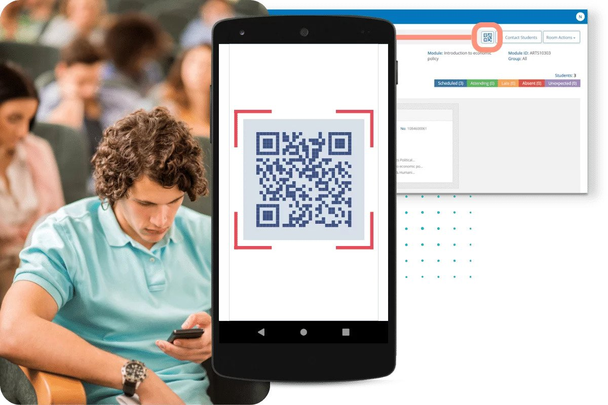

<a name="readme-top"></a>

<!-- PROJECT LOGO -->
<br />
<div align="center">
  <a href="https://github.com/othneildrew/Best-README-Template">
    
  </a>

  <p align="center">
    <br />
    <a href="https://github.com/genus-so/docs"><strong>Explore the docs »</strong></a>
    <br />
    <br />
    <a href="https://github.com/genus-so/demo">View Demo</a>
    ·
    <a href="https://github.com/genus-so/demo">Report Bug</a>
    ·
    <a href="https://github.com/genus-so/demo">Request Feature</a>
  </p>
</div>

---

#  Checkpoint

[Checkpoint](https://checkpoint.app) is a mobile attendance system built to eliminate the time and effort wasted in taking attendances in schools and colleges. It also greatly reduces the amount of paper resources needed in attendance data management.

<!-- DOCUMENTATION -->

## ☁ Documentation

For full documentation, visit [Documentation](docs.md)

## 🛠️  Built With

This project was developed using a diverse set of frameworks and libraries, which contributed to its robustness and efficiency. 

Here are the major technologies utilized:

* [![Next][Next.js]][Next-url]
* [![React][React.js]][React-url]
* [![Vue][Vue.js]][Vue-url]
* [![Angular][Angular.io]][Angular-url]
* [![Svelte][Svelte.dev]][Svelte-url]
* [![Laravel][Laravel.com]][Laravel-url]
* [![Bootstrap][Bootstrap.com]][Bootstrap-url]
* [![JQuery][JQuery.com]][JQuery-url]

With this diverse technology stack, the project achieves a well-rounded combination of cutting-edge frontend and backend tools, ensuring a smooth and feature-rich user experience.

<p align="right">(<a href="#readme-top">back to top</a>)</p>

<!-- CONTRIBUTING -->
## 👥Contributing

Contributions are what make the open source community such an amazing place to learn, inspire, and create. Any contributions you make are **greatly appreciated**.

If you have a suggestion that would make this better, please fork the repo and create a pull request. You can also simply open an issue with the tag "enhancement".
Don't forget to give the project a star! Thanks again!

1. Fork the Project
2. Create your Feature Branch (`git checkout -b feature/AmazingFeature`)
3. Commit your Changes (`git commit -m 'Add some AmazingFeature'`)
4. Push to the Branch (`git push origin feature/AmazingFeature`)
5. Open a Pull Request

<p align="right">(<a href="#readme-top">back to top</a>)</p>

## 💪 What can I contribute?

You can contribute to Checkpoint in any form that you would like to! For instance, you may:

- Participation in the community, by answering questions on GitHub open issues and in our chat groups, helps us maintain a healthy and active community of users.
- We welcome your proposals for new features, as well as reporting issues and bugs to Checkpoint .
- Submit codes to Checkpoint .
- Other contributions include suggestions for website improvements and documentation.
- Become a Top Genus Committer!

## 📐 The contribution workflow
Here's a step-by-step guide to contributing code to Kanaries RATH:

- Take a look at the existing [Issues](https://checkpoint.app) or create a new issue.
- [Fork the Repo](https://checkpoint.app) from our GitHub. Create a branch for any issue that you are working with, and commit your work.
- Create a [Pull Request](https://checkpoint.app) (a.k.a. Create a PR). We will review and process your Pull Request.
- Now that your Pull Request has been approved, you've officially become a Genus Committer!

## 🐞 How can I report an issue?
The open-source community values constructive questions. Before submitting an issue, make sure you have done your research and reviewed the following:

- Avaialble documentations and FAQ.
- Opened issues on our GitHub repo.
- Existing Pull Requests.
  
Then you can open a new [Issues](https://checkpoint.app) on the GitHub page with a detailed description of the problem. The community will be happy to help!

<p align="right">(<a href="#readme-top">back to top</a>)</p>

## 📐 Join the Developer List
To foster a sense of community and to recognize the contributions of each participant, we encourage you to include your details in the Developers List located in the repository. Here's how you can do it:

   a. In the repository's root directory, find to the "developers_list.md" file.

   b. Open the "developers_list.md" file.

   c. Add your name, GitHub username, and a brief description (optional) about yourself to the list. You can use the following format:

   ```
   - Name: John Doe
     GitHub: johndoe
     Description: Front-end enthusiast, passionate about UI/UX design.
   ```

   d. Save the changes to the file and commit them to your local repository.

   e. Create a new branch (optional) and push your changes to the remote repository.

   f. Submit a pull request (PR) with your modifications to the main branch of the project repository.

If you have any questions or encounter any issues during this whole process, please reach out to our support team at [support-email@example.com](mailto:support-email@example.com).

<!-- USAGE EXAMPLES -->

<p align="right">(<a href="#readme-top">back to top</a>)</p>

<!-- ROADMAP -->
## 🆕 Roadmap

- [x] Student Attendance List Creation
- [x] Attendance Marking
- [ ] Attendance Storage
- [ ] Attendance sheet transfer
- [ ] Attendance Check
- [ ] Multi-language Support
    - [ ] Chinese
    - [ ] Spanish

<p align="right">(<a href="#readme-top">back to top</a>)</p>

<!-- LICENSE -->
## 💼 License

Distributed under the MIT License. See `LICENSE.md` for more information.

<p align="right">(<a href="#readme-top">back to top</a>)</p>

<!-- CONTACT -->
## 📱 Contact Us on Twitter

Do you have any questions, feedback, or inquiries ? We'd love to hear from you! Reach out to us on X App, and our dedicated team will be delighted to assist you.

Tweet us @genus_softorg, and we'll ensure a prompt response to your messages. Whether it's about our products, services, or any other matter related to our organization, we're here to help.

Join our Twitter community today and stay updated with the latest news, events, and announcements. We look forward to engaging with you on our social media platform!

#ContactUs #CustomerSupport #SocialMedia 

Send us a DM on the X App - [Genus Software Organizaiton](https://twitter.com/genus_softorg) 

<p align="right">(<a href="#readme-top">back to top</a>)</p>

<!-- ACKNOWLEDGMENTS -->
## 🙏 Acknowledgments

We would like to express our heartfelt gratitude to the following platforms, whose exceptional tools and resources played a pivotal role in bringing this project to life

* [Choose an Open Source License](https://choosealicense.com)
* [GitHub Emoji Cheat Sheet](https://www.webpagefx.com/tools/emoji-cheat-sheet)
* [Malven's Flexbox Cheatsheet](https://flexbox.malven.co/)
* [Malven's Grid Cheatsheet](https://grid.malven.co/)
* [Img Shields](https://shields.io)
* [GitHub Pages](https://pages.github.com)
* [Font Awesome](https://fontawesome.com)
* [React Icons](https://react-icons.github.io/react-icons/search)

<p align="right">(<a href="#readme-top">back to top</a>)</p>

<!-- MARKDOWN LINKS & IMAGES -->
<!-- https://www.markdownguide.org/basic-syntax/#reference-style-links -->
[contributors-shield]: https://img.shields.io/github/contributors/othneildrew/Best-README-Template.svg?style=for-the-badge
[contributors-url]: https://github.com/othneildrew/Best-README-Template/graphs/contributors
[forks-shield]: https://img.shields.io/github/forks/othneildrew/Best-README-Template.svg?style=for-the-badge
[forks-url]: https://github.com/othneildrew/Best-README-Template/network/members
[stars-shield]: https://img.shields.io/github/stars/othneildrew/Best-README-Template.svg?style=for-the-badge
[stars-url]: https://github.com/othneildrew/Best-README-Template/stargazers
[issues-shield]: https://img.shields.io/github/issues/othneildrew/Best-README-Template.svg?style=for-the-badge
[issues-url]: https://github.com/othneildrew/Best-README-Template/issues
[license-shield]: https://img.shields.io/github/license/othneildrew/Best-README-Template.svg?style=for-the-badge
[license-url]: https://github.com/othneildrew/Best-README-Template/blob/master/LICENSE.txt
[linkedin-shield]: https://img.shields.io/badge/-LinkedIn-black.svg?style=for-the-badge&logo=linkedin&colorB=555
[linkedin-url]: https://linkedin.com/in/othneildrew
[product-screenshot]: images/screenshot.png
[Next.js]: https://img.shields.io/badge/next.js-000000?style=for-the-badge&logo=nextdotjs&logoColor=white
[Next-url]: https://nextjs.org/
[React.js]: https://img.shields.io/badge/React-20232A?style=for-the-badge&logo=react&logoColor=61DAFB
[React-url]: https://reactjs.org/
[Vue.js]: https://img.shields.io/badge/Vue.js-35495E?style=for-the-badge&logo=vuedotjs&logoColor=4FC08D
[Vue-url]: https://vuejs.org/
[Angular.io]: https://img.shields.io/badge/Angular-DD0031?style=for-the-badge&logo=angular&logoColor=white
[Angular-url]: https://angular.io/
[Svelte.dev]: https://img.shields.io/badge/Svelte-4A4A55?style=for-the-badge&logo=svelte&logoColor=FF3E00
[Svelte-url]: https://svelte.dev/
[Laravel.com]: https://img.shields.io/badge/Laravel-FF2D20?style=for-the-badge&logo=laravel&logoColor=white
[Laravel-url]: https://laravel.com
[Bootstrap.com]: https://img.shields.io/badge/Bootstrap-563D7C?style=for-the-badge&logo=bootstrap&logoColor=white
[Bootstrap-url]: https://getbootstrap.com
[JQuery.com]: https://img.shields.io/badge/jQuery-0769AD?style=for-the-badge&logo=jquery&logoColor=white
[JQuery-url]: https://jquery.com 
